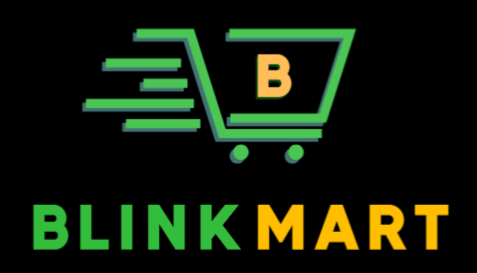

# 🛒 BlinkMart Client

<div align="center">
  
  <br />
  <h3>Modern E-Commerce Web Application</h3>
</div>

Welcome to **BlinkMart** – a sleek, responsive, and feature-rich e-commerce application built with React and modern web technologies. This client-side application delivers a seamless shopping experience with a focus on performance, usability, and elegant design.


---

## ✨ Features

- **🎨 Modern UI/UX**: Intuitive design with dark mode, smooth transitions and responsive layouts
- **🔒 Authentication**: Complete user flow with login, registration, email verification, and password reset
- **🔎 Product Discovery**: Advanced search, category browsing, and filters for finding products quickly
- **🛒 Shopping Cart**: Real-time cart management with persistent storage across sessions
- **💳 Payment Processing**: Integration with Razorpay, Cash on Delivery options with status tracking
- **📦 Order Management**: Comprehensive order history, status tracking, and detailed view
- **👤 User Profiles**: Customizable user profiles with address management and preferences
- **📱 Mobile Optimization**: Fully responsive design with optimized mobile experience
- **🚫 Error Handling**: Elegant error states and network issue handling with friendly 404 page
- **🔔 Notifications**: Real-time feedback system using toast notifications

---

## �️ Screenshots

<details>
  <summary>📸 View Application Screenshots</summary>
  <div align="center">
    <p><i>Home Page & Product Listing</i></p>
    
    <p><i>Product Details & Cart</i></p>
    
    <p><i>Checkout Flow & Orders</i></p>
    
    <p><i>User Dashboard</i></p>
    
  </div>
</details>

---

## 🛠️ Technology Stack

- **Frontend Framework**: [React 18](https://react.dev/) with functional components and hooks
- **State Management**: [Redux Toolkit](https://redux-toolkit.js.org/) for global state
- **Routing**: [React Router v7](https://reactrouter.com/) for navigation
- **Styling**: [Tailwind CSS](https://tailwindcss.com/) for utility-first styling
- **Build Tool**: [Vite](https://vitejs.dev/) for fast development and optimized builds
- **HTTP Client**: [Axios](https://axios-http.com/) for API communication
- **Payment Gateway**: [Razorpay](https://razorpay.com/) integration
- **Notifications**: [React Hot Toast](https://react-hot-toast.com/) for user feedback
- **Icons**: [React Icons](https://react-icons.github.io/react-icons/) for UI elements

---

## 🚀 Getting Started

### Prerequisites

- Node.js (v18 or higher recommended)
- npm or yarn package manager

### Installation

1. **Clone the repository**

```bash
git clone https://github.com/YourUsername/BlinkMart-Client.git
cd BlinkMart-Client
```

2. **Install dependencies**

```bash
npm install
# or with yarn
yarn install
```

3. **Environment Configuration**

Create a `.env` file in the root directory:

```env
VITE_API_BASE_URL=https://api.blinkmart.example.com
VITE_RAZORPAY_KEY_ID=your_razorpay_key
```

4. **Start development server**

```bash
npm run dev
# or with yarn
yarn dev
```

The application will be available at `http://localhost:5173`

### Building for Production

```bash
npm run build
# or with yarn
yarn build
```

Generated files will be in the `dist/` directory.

---

## �️ Project Structure

```
BlinkMart-Client/
├── public/                 # Public assets
├── src/
│   ├── assets/             # Images, fonts, and static files
│   ├── components/         # Reusable UI components
│   ├── config/             # Configuration files and API routes
│   ├── hooks/              # Custom React hooks
│   ├── layouts/            # Layout components
│   ├── pages/              # Page components
│   ├── routes/             # Routing configuration
│   ├── store/              # Redux store and slices
│   ├── util/               # Utility functions
│   ├── App.jsx             # Root component
│   ├── main.jsx            # Entry point
│   └── index.css           # Global styles
├── .env                    # Environment variables
├── package.json            # Dependencies and scripts
├── tailwind.config.js      # Tailwind CSS configuration
└── vite.config.js          # Vite configuration
```

---

## 🔍 Key Features Explained

### Authentication Flow

- **JWT-based Authentication** with access and refresh tokens
- **Email Verification** system for new accounts
- **Password Recovery** with secure reset mechanism

### Shopping Experience

- **Category Navigation** with nested subcategories
- **Product Details** with image gallery, specifications, and reviews
- **Related Products** recommendations

### Dashboard

- **Order Tracking** with status updates
- **Profile Management** for user information
- **Address Book** for saved delivery locations

---

## 🌐 API Integration

BlinkMart client connects to a RESTful backend API. For local development with your own backend:

1. Clone the [BlinkMart-API](https://github.com/YourUsername/BlinkMart-API) repository
2. Follow the setup instructions in its README
3. Update the `VITE_API_BASE_URL` in your `.env` file to point to your local API

---

## 📊 Admin Features

BlinkMart includes an admin dashboard for:

- Product management (add, edit, delete)
- Category and subcategory management
- Order processing and status updates
- User management

---

## 📱 Mobile Responsiveness

The application is fully optimized for:

- Smartphones (portrait and landscape)
- Tablets
- Desktop displays

## 🛡️ Security Best Practices

- **Secure Authentication**: JWT tokens with proper expiration and refresh mechanism
- **Protected Routes**: Role-based access control for admin and user areas
- **Data Encryption**: Sensitive information encrypted in transit
- **Input Validation**: Form validation on both client and server sides
- **Payment Security**: Secure handling of payment information through Razorpay
- **Error Handling**: Safe error messages that don't expose system details

---

## ⚙️ Performance Optimizations

- **Code Splitting**: Lazy loading of routes for faster initial load
- **Image Optimization**: Responsive image loading and optimization
- **Caching Strategy**: Efficient data caching for repeated requests
- **Reduced Bundle Size**: Optimized dependencies and tree-shaking
- **Hidden Scrollbars**: Clean UI with hidden scrollbars while maintaining functionality

---

## 🤝 Contributing

Contributions are welcome! Here's how you can help:

1. Fork the repository
2. Create a feature branch (`git checkout -b feature/amazing-feature`)
3. Commit your changes (`git commit -m 'Add some amazing feature'`)
4. Push to the branch (`git push origin feature/amazing-feature`)
5. Open a Pull Request

Please ensure your code follows the existing style and includes appropriate tests.

---

## 📄 License

This project is licensed under the [MIT License](LICENSE)

---

## � Acknowledgments

- [Razorpay](https://razorpay.com/) for payment processing
- [React](https://react.dev/) and its amazing ecosystem
- [Tailwind CSS](https://tailwindcss.com/) for simplified styling
- [Redux Toolkit](https://redux-toolkit.js.org/) for state management
- [Vite](https://vitejs.dev/) for the exceptional dev experience

---

<div align="center">
  <p><b>Made with ❤️ for the modern shopper</b></p>
  <p>© 2025 BlinkMart</p>
</div>
